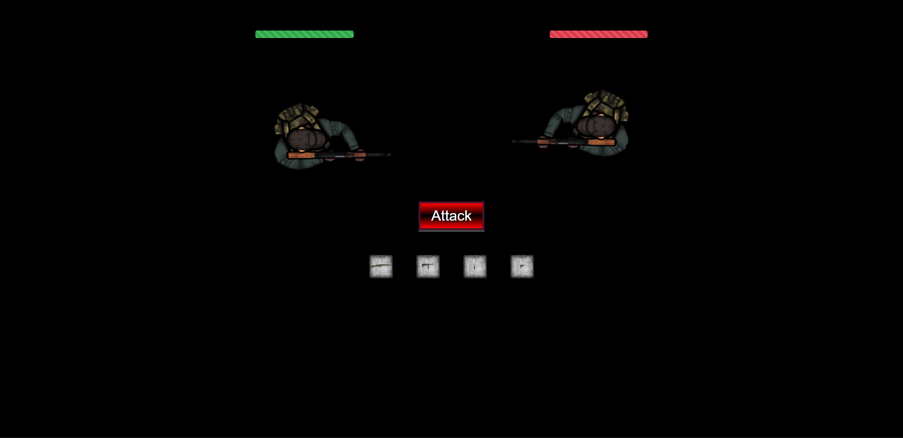

# twine-ganme
an animated combat twine game
</img>
# Features 
1. Animated two person combat
2. Health bars
3. Bootstrap injected into the head of the HTML documented upon compiling (with the shortcut)
# Configuring 
Simply compile the project using the compile shortcut, make sure you have Tweego installed first. 
# Credits 
Combat system: LilyCathelineau
custom-macros-for-sugarcube-2: ChapelR
Creators of the assets are credited in the folder in which their Assets are used. 
